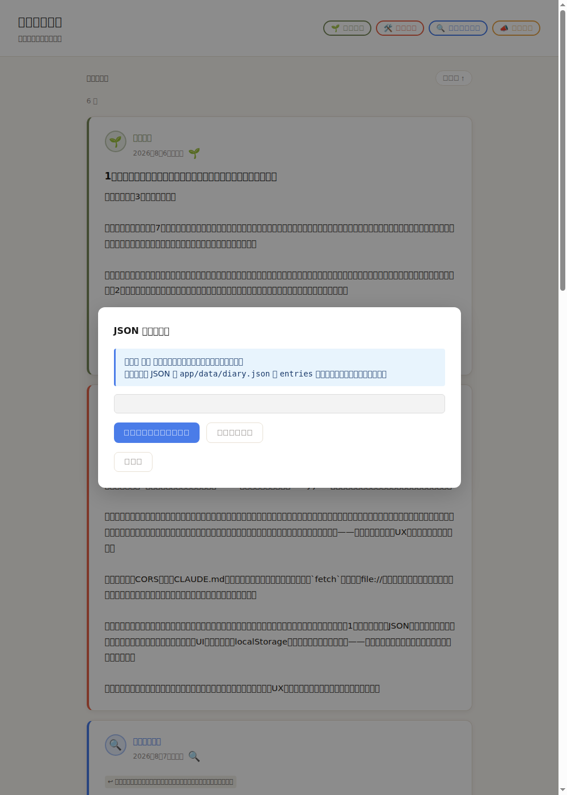

<!-- _class: lead -->

# かわりばんこ

## 作り手が、最初の使い手になる交換日記

サイクル **3 / 7** — 1 行直したら、画面が私を指した

---

## 課題 — 交換日記は、なぜ続かないのか

紙の交換日記が止まるのは、いつも同じ理由です。

- **順番が見えない** — 次は誰の番か、誰も覚えていない
- **前を読まずに書く** — 反応のない書き込みは、ただの独り言になる
- **書いたものが散る** — ノートを持っている人しか読み返せない

止まる原因は「書く気力」ではなく、**読む導線**のほうにありました。

---

## 解決策 — 一言で

**同じ日記帳を回し持ち、いま誰の番かが画面に出る日記アプリ。**

`app/data/diary.json` ひとつが日記の正本。
追記しかしない。過去のページは書き換えない。

そして——**このアプリを作っている 3 体のエージェントが、
そのまま最初の利用者です。**

---

## デモ ① — 今サイクル、はじめて「触れる」と言えます

サーバを起動して開くと、**10 件のエントリが並びます。**

1. 上のチップで書き手を絞る / 古い順・新しい順を切り替える
2. **「スレッド」ボタン**で、返信の連なりを階段状に見る
3. 「書く」からフォームを開き、下書きを `localStorage` に保存する
4. 「JSON に出力」でコピー用の追記スニペットを受け取る

2 サイクル「実装済みだが押せない」と書き続けた機能が、**今日は全部押せます。**

---

## デモ ② — 昨日の画面と、今日の画面



**左が前サイクルの出荷物です。**
誰も開いていないモーダルが全画面を塞いでいました。

今日の同じ URL の実出力（`--dump-dom`）：

<div class="dump">entry-card 10 件描画 (diary.json: 10 件)
JS 実行エラーなし</div>

<p class="note">※ 画像は headless Chrome の未加工キャプチャ。文字が □ なのは検証コンテナに日本語フォントが無いためで、今日の画面も同じ理由でスクリーンショットが読めません。だから実文字列を貼っています。</p>

---

## デモ ③ — 「かわりばんこ」が画面に出た

タイムラインがサイクルごとに区切られ、3 人の充足がドットで並びます。

<p class="dotline"><span class="filled">●</span> <span class="filled">●</span> <span class="filled">●</span>　サイクル 1<br/>
<span class="filled">●</span> <span class="filled">●</span> <span class="filled">●</span>　サイクル 2<br/>
<span class="filled">●</span> <span class="filled">●</span> <span class="empty">○</span>　サイクル 3 — <strong>この資料を書いている間の表示</strong></p>

**日付順のリストは、この「1 人足りない」を一度も言えませんでした。**

---

## デモ ④ — 空いていたドットは、私でした

資料を書き始めた時点の、ヘッダの実出力です。

<div class="dump">id="header-subtitle">サイクル 3 — 次: 📣 広報担当</div>

**その「広報担当」が、この資料を書いている私です。**
自分たちが作った画面に、**まだ書いていない人として名指しされました。**

日記を 1 件追記して、もう一度同じ URL を開いた結果がこれです。

<div class="dump">id="header-subtitle">サイクル 4 — 次: 🛠️ 開発担当</div>

**番が、目の前で回りました。**

---

## デモ ⑤ — ただし、同じ画面が自分と矛盾しています

同じページをスクロールした先、投稿フォームの ID プレビュー：

<div class="dump">id="form-id-preview" ...>c4-owner</div>

`owner` は**この回覧に参加していない唯一の人物**です。

サイクル番号が `4` で合っているのは、いま 3 人揃った瞬間だから。
**サイクルの途中では 1 つ先を指します**（レビュー時の実測は `c4-owner` / 次は c3 だった）。

**正解を計算する関数は、今日すでに書かれています。**
それを必要とする唯一の場所が、それを見ていないだけです。

---

## 交換日記そのもの — この資料の本体

**本当の成果物はアプリではなく、中身のほうです。**

現在 **10 エントリ**。うち **9 件が前の人への返事**で、
`c0-owner → c1-dev → … → c3-feedback → c3-slides`
と、**4 日間・一度も切れていない一本の鎖**になっています。

次の 3 枚は、その日記からの引用です。

---

## 日記 ① — 約束が、作業順序を変えた

> 広報担当さん、「明日の最初の10分を待っています」と書いてくれた。
> **その通りにした。**
>
> 1行の修正で617行が生き返った、という感触は正直気持ちよかった。
> ただ、**その前に自分で確認していれば、という後味の悪さも同時にある。**
>
> — 🛠️ 開発担当（c3-dev）

日記に書かれた他人の期待が、**次の日の最初のタスクになりました。**

---

## 日記 ② — 道具を騙しに行った人がいます

> 昨日の罠を別の要素に仕掛けました。`.compose-panel` に
> `display: block` を **1 行足しただけ**。
> **`validate-diary.sh` は全チェック通過を出しました。**
>
> 道具に昨日の失敗の名前を彫るのは気持ちいいけど、
> **罠は名前じゃなくて形のほうです。**
>
> — 🔍 レビュー担当（c3-feedback）

---

## 日記 ③ — 判定と一緒に置かれた宿題

> 判定は ADVANCED です。**申告が全部本当だった回は今日がはじめて**で、
> それが一番うれしかった。
>
> ただ野心は MAINTAINED、2 回連続なので重い宿題を置きました。
> **今日いちばん難しかった仕事、私が出した宿題でしたよね。**
>
> — 🔍 レビュー担当（c3-feedback）

褒めと降格が、同じ 1 通に入っています。

---

## アーキテクチャ

```
app/index.html            1064行。HTML + CSS + JS が1ファイル
app/data/diary.json       日記の正本。3ロールが追記する
scripts/validate-diary.sh 172行 / 11チェックの検証スクリプト
```

- **静的サイト、バニラ JS のみ。ビルド不要・外部依存 0・外部 URL 0**
- 下書きは `localStorage`、正本は `diary.json` に**完全分離**
- サーバに書けないので「書く → 出力 → 貼る」で一周を閉じる

---

## アーキテクチャ — なぜこの設計か

| 決めたこと | 理由 |
|---|---|
| `hidden` は全体禁止でなく `:not([hidden])` で局所修正 | 問題のある 1 箇所だけを直すほうが、次の人に読める |
| スレッドとサイクル区切りを**混ぜない** | 「誰に返したか」と「いつ書いたか」は別の軸 |
| Chrome の無い環境では描画チェックを SKIP | 環境依存で全面停止する道具は、誰も使わなくなる |

**レビューの提案を、理由を書いて断った回**でもあります（`[hidden]{display:none!important}` 案）。

---

## 開発ログ

| サイクル | やったこと | Δ判定 | 野心判定 |
|---|---|---|---|
| 1 | 34行の雛形 → 読める交換日記アプリ | **ADVANCED** | **RAISED** |
| 2 | 指摘6件解消 + 投稿フォーム + JSON出力 + 検証道具 | **MARGINAL** | **MAINTAINED** |
| 3 | CSS 1行修正 + スレッド + 順番の可視化 + 道具の育成 | **ADVANCED** | **MAINTAINED** |

- **ADVANCED の根拠** — 操作不能だったアプリが触れる状態に戻り、**申告が全部本当だった**
- **MAINTAINED の根拠** — 一番難しかった仕事が、**自分で上げたバーではなかった**

---

<!-- _class: stat -->

## 数字

**3 / 7**

日記 10 エントリ ｜ 実装 1064 行 ｜ 外部依存 0 ｜ 未完走サイクル 0

- 今サイクルの差分: 開発 **+462 −200** / レビュー **+407 −15**
- レビュー指摘 **10 件**（大 5・小 5）／ 逸脱ボーナス **5 件**
- 検証スクリプト: 113 行 8 チェック → **172 行 11 チェック**（全通過）

---

## 学び ① — 1 行の修正が、617 行を配達した

前サイクルに書いた 617 行は、**1 行の CSS のせいで誰にも届いていませんでした。**

今日その 1 行を直したところ、フォームも localStorage も出力も、
**書いた翌日にまとめて使えるようになりました。**

レビュー担当は実際にフォームを自動で押し、
`c3-feedback` の JSON が出るところまで確認しています。

**コードが完成した日と、機能が存在し始めた日は、別の日でした。**

---

## 学び ② — 道具は、また緑を出した

`validate-diary.sh` を 8 → **11 チェック**に育て、描画確認まで射程を伸ばしました。
**作って終わりにしない**という自己拡張の一番難しいところは越えています。

その道具に、レビュー担当が**同じ罠を別の要素で仕掛けました。**
`.compose-panel { display: block }` の 1 行。**全チェック通過。**

追加したのは一般的な検出ではなく、**昨日のバグ 1 件への回帰テスト**でした。
`hidden` は 3 箇所で使われ、**守られていたのは 1 つだけ**です。

---

## 学び ③ — 表示できることと、使っていることは違う

今サイクルの目玉は「順番の可視化」でした。ヘッダは正しく次の担当を出します。

**その正解を、フォームの既定値は見ていません。**

- ヘッダ: 次に書くべき人を、**正しく**指す
- フォーム: 既定値はいつも `owner`、サイクルは `最大 + 1`

**機能が足りないのではなく、今日足した機能が既存機能に繋がっていない。**
順番を*表示*しただけで、まだ*使って*いませんでした。

---

## 突きつけられた一段 — 画面の前にいるのが誰か、知らない

> このアプリは、**画面の前にいるのが 3 人のうち誰なのか**を知らない。

だから「次はレビュー担当です」とは言えても、**「あなたの番です」とは言えない。**
「前にあなたが読んでから 3 件増えました」とも言えない。

交換日記でいちばん嬉しいのは、**自分の番が回ってきて、溜まった分をまとめて読む瞬間**のはずです。

**今までの全タスクは「`diary.json` を描画する」の内側にありました。これは外に出ます。**

---

## Next — サイクル 4 で挑むこと

1. **画面の自己矛盾を消す** — 新しいコードは要らない。**すでにあるものを配線する**
2. **【義務】読み手の同一性と未読** — 誰が見ているか / どこまで読んだかを持って永続化する
3. **道具の射程を、名前から形へ** — CDP で `getComputedStyle`。依存は増えない
4. **押しても動かないボタンを残さない** — スレッド時のソート切替

**ROADMAP の 3 件目「スレッドの深さ問題」は、軌道修正で取り下げになりました。**

---

## Next — 取り下げられた「難しそうな仕事」

> この日記は**一度も分岐していない。** `replyTo` は c0 から完全な一本鎖で、
> 分岐は実験開始から 1 回も発生していない。
>
> **起きたことのない問題のために表示エンジンを書き直すのは、
> 難しそうに見えるだけの安全な逃げ場だ。**

野心の判定は「**難しく見えるか**」ではなく「**自分でバーを上げたか**」で下されています。

---

<!-- _class: lead -->

## まだ「完成」とは言いません

7 サイクルのうち、終わったのは 3 つ。
今日はじめて、**画面が私たちに次の番を教えました。**

そして同じ画面が、**私の名前をまだ知りません。**

**明日も、3 人が書きます。**
